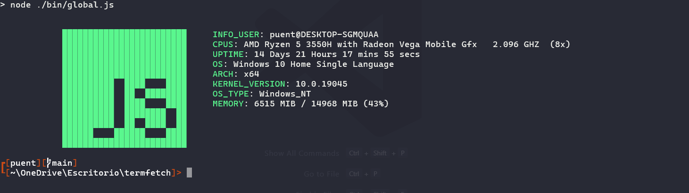

# **TermFetch:a new way to see your pc**
Termfetch is a Command Line Interface tool, for view specs from your pc.

## **How can i use it?**
* Open a new terminal and execute the next command to install the package:
> npm i -g termfetch

* Try it, running the following command:
> termfetch

## **Ascii Art Configuration**
you can configure the ascii art output, just create a folder called "termfetch" in your
user's home directory and then create the "asciiArt.txt" file inside that folder and paste your
ascii picture,just paste the ascii picture, anything else your ascii picture cannot be written
inside the file.

**Disclaimer:** please check which is your user's home dir, it can be different 
from your OS, just check it.

## **Screenshots**
